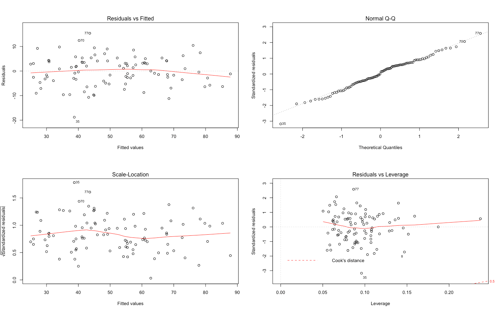

# WineRating
Implemented machine learning in small size dataset.

#### About
This project was created with R, utilising machine learning to predict wine price, given countries of origin. Original dataset was taken from Kaggle, in which I practiced machine learning with a different language.

#### Example of Data Visuals

